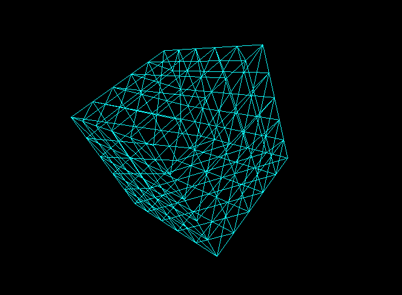

# sphero-gyroscope

Use your sphero as a 3D controller.
This is an experiment.



## Run it

You need to pair your sphero to your computer via bluetooth.
The pairing is done through a port I call `SPHERO_PORT`.
To know the `SPHERO_PORT` see [How to Connect](https://github.com/hybridgroup/cylon-sphero#how-to-connect).

```sh
export SPHERO_PORT=/dev/tty.Sphero-BGO-AMP-SPP

git clone git@github.com:palmerabollo/sphero-gyroscope.git && cd sphero-gyroscope
npm install
node server
```

Navigate to [localhost:3000](http://localhost:3000) and control the 3D cube
with your sphero.

## License

MIT
